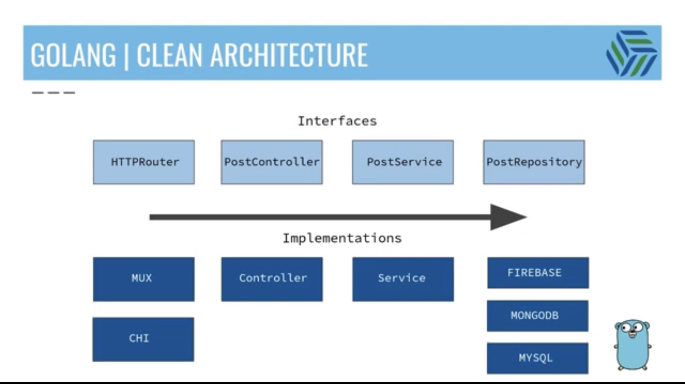

# go-rest-api-pet-project

Go Lang Web development project to create a REST API with simple CRUD operations

## Project Structure
```tree
.
├── LICENSE
├── README.md
├── controller
│   └── post-controller.go
├── entity
│   └── post.go
├── errors
│   └── service-error.go
├── go.mod
├── go.sum
├── golang-rest-api
├── repository
│   ├── firestore-repo.go
│   └── posts-repo.go
├── router
│   ├── mux-router.go
│   └── router.go
├── server.go
└── service
    └── post-service.go
```

## Project Description
This project aims to develop a robust REST API using the Go programming language, specifically leveraging the Gorilla mux router and Firestore as the database. The goal is to create a simple yet efficient system that supports CRUD (Create, Read, Update, Delete) operations for data management.

The project will begin with setting up the Go development environment and configuring the necessary dependencies. Gorilla mux, a powerful HTTP router and URL matcher for building Go web servers, will be utilized to handle routing and request handling efficiently. Its flexibility and extensive features make it an ideal choice for creating a RESTful API.

Firestore, a flexible and scalable NoSQL document database provided by Google Cloud, will be integrated as the primary data storage solution. Firestore offers real-time data synchronization, automatic scaling, and powerful querying capabilities, making it well-suited for modern web applications.

The REST API will provide endpoints for performing CRUD operations on various resources, such as user profiles, products, or any other domain-specific entities relevant to the project. The API will follow RESTful principles, using appropriate HTTP methods (GET, POST, PUT, DELETE) and status codes (200, 201, 204, etc.) to ensure a consistent and intuitive interface for client applications.

To ensure security and proper authentication, the project will implement appropriate measures, such as using secure communication protocols (HTTPS) and incorporating authentication mechanisms like JSON Web Tokens (JWT) or API keys.

## Clean Architecture principles
The project follows a clean architecture approach to maintain modularity and separation of concerns. The execution order of the classes is as follows:

1. `server.go`: Initializes the HTTP server and sets up the router.
2. `router/mux-router.go`: Defines the routes and maps them to the respective controller methods.
3. `controller/post-controller.go`: Handles HTTP requests and calls the corresponding service methods.
4. `service/post-service.go`: Implements the business logic for CRUD operations and interacts with the repository.
5. `repository/posts-repo.go`: Provides an abstraction layer for data access and communicates with the Firestore database.
6. `repository/firestore-repo.go`: Implements the specific Firestore-related functions to interact with the database.
7. `entity/post.go`: Defines the structure and properties of the post entity.
8. `errors/service-error.go`: Defines custom error types and handles service-level errors.

**Here is the image of the architecture diagram for this project:**



Additionally, the project focuses on writing clean and maintainable code, adhering to best practices and design patterns commonly used in Go web development. This includes proper error handling, logging, and separation of concerns to ensure the codebase is scalable and extensible.

Overall, this Go Lang web development project leverages the power of Gorilla mux and Firestore to create a reliable, scalable, and performant REST API with simple CRUD operations. The end result is a well-designed and robust web application ready to handle a variety of client requests and efficiently manage data using the power of Go and the features provided by Firestore.

## Project Setup
### Install Go
1. Download and install Go from the official website: https://golang.org/dl/
2. Verify the installation by running the following command in the terminal:
```bash
go version
```
### Install Gorilla Mux
1. Install the Gorilla Mux package using the following command:
```bash
go get -u github.com/gorilla/mux
```
2. Import the package in the `router/mux-router.go` file:
```go
import (
    "github.com/gorilla/mux"
)
```
### Install Firestore
1. Install the Firestore package using the following command:
```bash
go get cloud.google.com/go/firestore
```
2. Import the package in the `repository/firestore-repo.go` file:
```go
import (
    "cloud.google.com/go/firestore"
)
```
### Build and Run the Project
1. Build the project using the following command:
```bash
go build
```
2. Run the project using the following command:
```bash
go run golang-rest-api.
```
